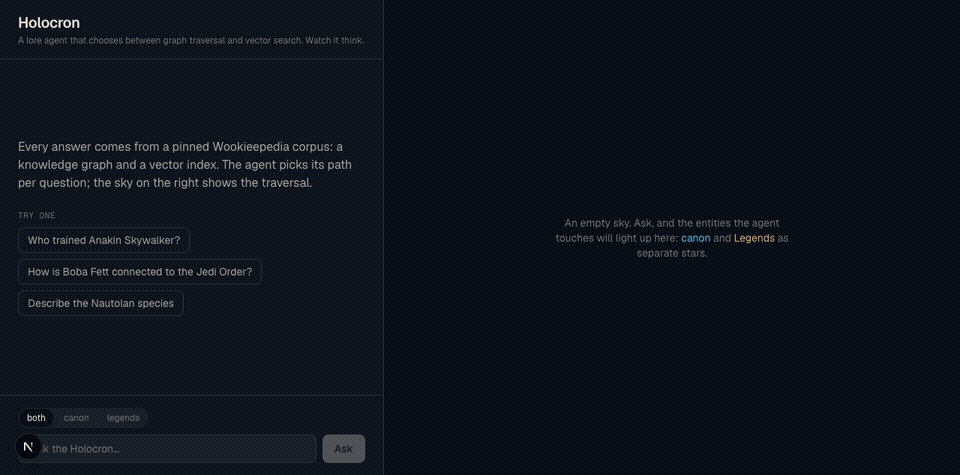
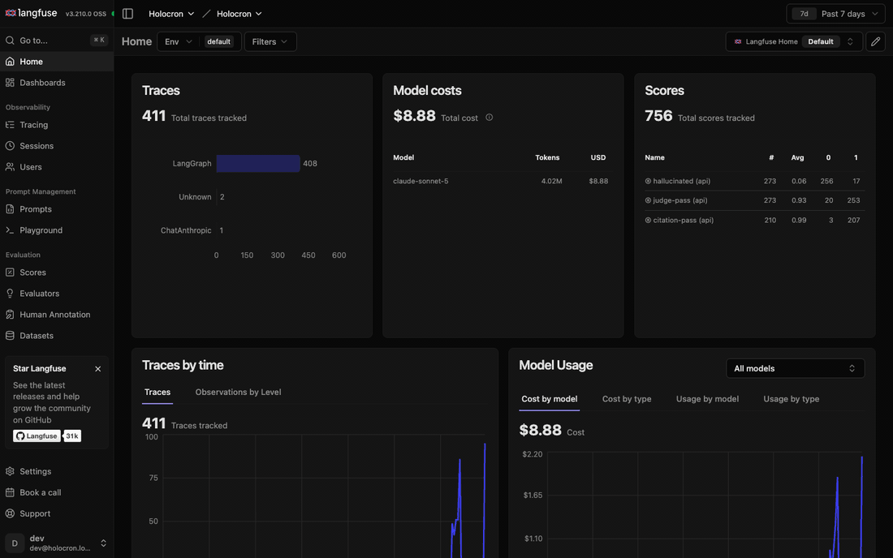

# Holocron

Star Wars lore agent that decides at runtime between vector search and
knowledge-graph traversal, with a comparative eval (vector-only vs graph-only vs
agent) as the project's centerpiece. Vocabulary in [CONTEXT.md](CONTEXT.md),
decisions in [DECISIONS.md](DECISIONS.md) and [docs/adr/](docs/adr/).



*Two questions, two strategies — chosen by the agent, not by config. The
relational one ("How is Boba Fett connected to the Jedi Order?") routes to
`path_between` and fans a constellation out of the graph; the narrative one
("Describe the Nautolan species") routes to `search_chunks` and hangs
document satellites off the entities it cites. Canon glows blue, Legends
amber, and the sky accumulates across questions.*

## How it works

Every question follows the same loop (a LangGraph state graph, ADR-0001):

1. **Route** — one LLM call reads the question and picks tools: graph
   traversal (`get_entity`, `get_relations`, `path_between`) for relational
   facts, vector search (`search_chunks`) for narrative ones, or both.
2. **Retrieve** — tools run against Neo4j and pgvector; every result carries
   a `canon | legends` continuity tag.
3. **Synthesize** — the model answers strictly from tool results (the corpus
   outranks its own memory) and streams the answer plus continuity-tagged
   citations over SSE.

The corpus is ~5,900 Wookieepedia pages pinned by revision id in
[`corpus.lock`](corpus.lock), so every result in this README is reproducible
bit-for-bit.

## Results

Does the agent's runtime choice between vector search and graph traversal beat
either strategy alone? LLM-Judge pass rate per category (30-question Golden Set,
run `20260710T215754Z`, corpus.lock `c82411f2`, judge: Opus, rubric pinned;
deltas vs the first baseline `20260710T181909Z`):

| Category | vector-only | graph-only | agent |
|---|---|---|---|
| single-hop | 100% (8/8) | 100% (8/8) | 100% (8/8) |
| multi-hop | 87% (7/8) | 100% (8/8) +13pp | 87% (7/8) |
| **continuity-conflict** | **85% (6/7) +57pp** | **100% (7/7) +29pp** | **100% (7/7) +15pp** |
| unanswerable (refusal) | 100% (7/7) | 100% (7/7) | 100% (7/7) +15pp |

Two baselines tell the story. The **first run** exposed the failure mode the
graph exists to prevent — vector-only scored **28%** on continuity-conflict,
blending canon and Legends into one answer — and its dominant *agent* failure
was subtler: report the corpus correctly, then "correct" it from the model's
own memory ("Leia is also traditionally his daughter in Legends"). The **second
baseline** is the eval loop paying off: three prompt rules derived directly
from failing traces (the corpus outranks the model's memory — no reconciling
asides; refuse only after retrying name variants; answer with the corpus's own
names, even awkward ones like the page "Yoda's species") lifted the agent to
**29/30** and graph-only to **30/30**, with zero category regressions. The gap
that remains is retrieval, not prompting: vector-only still misses the one
continuity-conflict question whose answer lives only in the graph's edges.

One full run costs **~US$3 / ~1.5h**: 90 Sonnet answer runs (the only paid
part; wall time inflated by org-tier rate limits) + 90 free Opus verdicts via
the `claude` CLI (~25 min). Re-judging is free; single-category iteration
costs cents.

Current Baseline: [`20260711T110335Z`](eval/baselines/20260711T110335Z/report.md) —
the same system on **pgvector** (ADR-0005). The agent held 29/30 with zero
category change through the vector-store swap; the flips concentrate in
vector-only's volatile continuity-conflict category, and retrieval diffs show
0-1 chunk changes at the top-8 margin (analysis in PR #38).

Full report — every failing question and every baseline-flip with its Langfuse
trace id — lives in
[`eval/baselines/20260710T215754Z/report.md`](eval/baselines/20260710T215754Z/report.md);
open the trace ids in the local Langfuse UI (<http://localhost:3001>) to debug.
Reproduce with the [eval commands](#eval) below — deltas are always reported
against the latest Baseline.

## Setup

Prerequisites: Docker, [uv](https://docs.astral.sh/uv/).

```sh
docker compose up -d --wait   # Neo4j + Langfuse (one command, no UI clicking)
cp .env.example .env          # then add your ANTHROPIC_API_KEY (+ an embedding key)
uv sync
```

The Langfuse project and API keys are pre-provisioned by docker-compose — the
values in `.env.example` work as-is. UI: <http://localhost:3001>
(`dev@holocron.local` / `holocron123`). Neo4j browser: <http://localhost:7474>
(`neo4j` / `holocron123`).

## Build the knowledge base

The corpus is pinned by [`corpus.lock`](corpus.lock) (page title → revision id,
ADR-0002), so the raw cache is reproducible from the repository:

```sh
uv run python -m ingest rebuild   # fetch every page at its pinned revision (~15 min)
uv run python -m ingest parse     # cache -> entities.jsonl + chunks.jsonl (~2 min)
uv run python -m ingest graph     # entities -> Neo4j (~1 min)
uv run python -m ingest embed     # chunks -> pgvector (~10 min, needs an embedding key)
```

Expected costs: the embed run is one-time ~US$0.20 on OpenAI
(`text-embedding-3-small`) or free within Voyage's quota (`voyage-3-lite`,
requires a payment method on file for usable rate limits). Questions cost a
few cents each (Claude Sonnet + one query embedding).

## Ask a question

```sh
uv run python -m agent.smoke      # one traced LLM call — check the Langfuse UI
uv run python -m api              # serve the agent on :8000
curl -N localhost:8000/ask -X POST -H 'content-type: application/json' \
     -d '{"question": "What species is Kit Fisto?"}'
```

`POST /ask` streams SSE events (`tool_call`, `tool_result`, `answer_delta`,
`done` with continuity-tagged citations, `error`); every run is traced in
Langfuse.

## Every run is traced (Langfuse)



*Nothing here is a screenshot of someone else's demo — this is the project's
own local Langfuse (`docker compose up`), and the tour above shows, in order:*

1. **The project dashboard** — every trace, token and dollar across dev and
   eval runs, plus the eval scores tracked over time (`judge-pass`,
   `hallucinated`, `citation-pass`).
2. **The trace list** — one trace per question, from the UI, the API, or the
   eval harness.
3. **A full agent trace** — the span tree (route → tools → synthesize) next
   to the rendered LangGraph state graph, with latency and cost per span.
4. **A tool span** — the exact `search_chunks` query the agent issued and the
   chunks it got back; this is the level at which eval failures get debugged.
5. **A generation span** — model, token counts, time-to-first-token, cost,
   and the full system prompt.
6. **The golden set as a Langfuse dataset** — 30 questions across 4
   categories, versioned in the repo and pushed via `eval push`, so every
   eval run links its scores back to the traces that produced them.

Eval regressions cite trace ids ([example report](eval/baselines/20260710T215754Z/report.md)) —
debugging a failing question means opening its trace, not re-running the
system and hoping.

## Watch it think (web UI)

```sh
uv run python -m api              # terminal 1: the agent on :8000
cd frontend && npm install && npm run dev   # terminal 2: the UI on :3000
```

Chat on the left, the live traversal on the right: ask a relational question
and watch the graph fan out; ask a narrative one and watch document satellites
orbit their entities. Click any node for everything the agent retrieved about
it; the both/canon/legends toggle restricts answers per continuity. Port
details and test commands in [frontend/README.md](frontend/README.md).

## Development

```sh
uv run ruff check . && uv run pyright && uv run pytest
```

Tool tests run against the real Neo4j (they skip if it's down, and seed an
empty graph from `tests/fixtures/`). Agent behavior is measured only by the
eval harness — never mocked.

## Eval

```sh
uv run python -m eval answer        # run the three strategies over the golden set (~US$ cents/question)
uv run python -m eval judge         # grade answers via the local `claude` CLI (free on subscription)
uv run python -m eval report        # citation check + judge scores vs the Baseline
uv run python -m eval push          # golden set -> Langfuse dataset; scores -> traces
uv run python -m eval promote <run> # designate a run as the Baseline (explicit)
```

The Judge runs through a **logged-in Claude Code CLI** (`claude login`), pinned
to Opus — stronger than the Sonnet system under test, zero marginal cost. The
eval is local-only and manual; CI never runs it.

## Attribution

Lore content is sourced from [Wookieepedia](https://starwars.fandom.com/) and
is available under
[CC-BY-SA](https://www.fandom.com/licensing).
